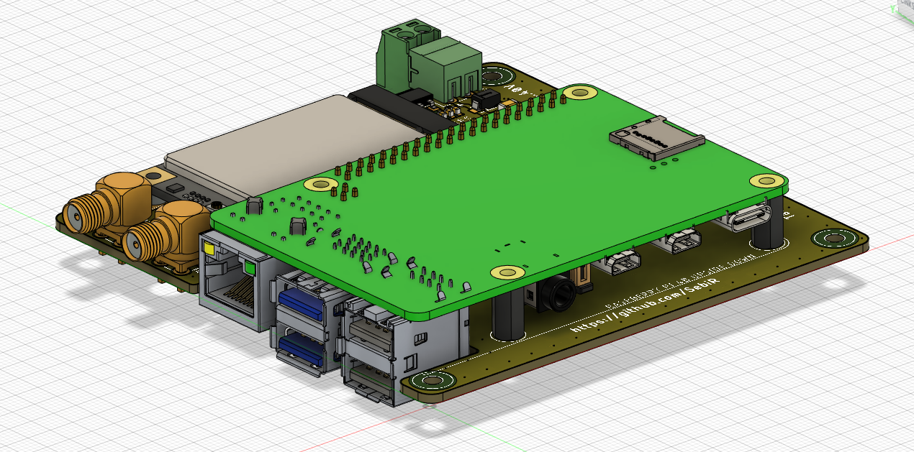
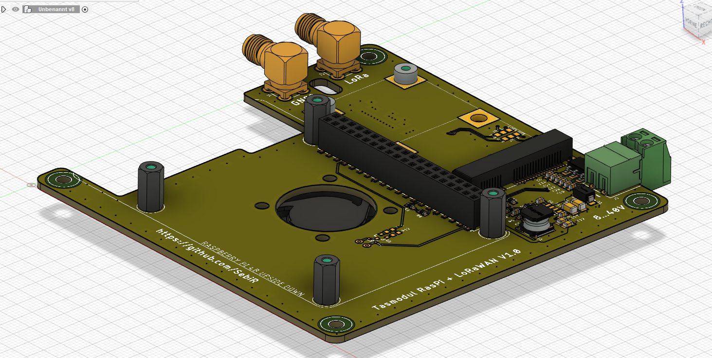
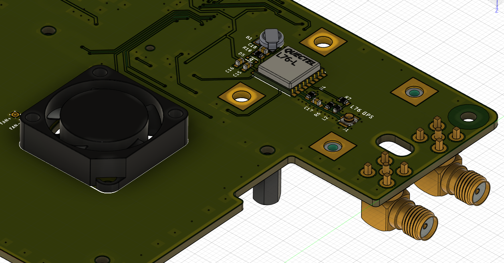

# Tasmodul Raspberry Pi + LoRa Concentrator
A 100x100mm "Tasmodul" PCB for a Raspberry Pi with the option to populate a LoRaWAN mini PCIe card to work as a LoraWAN gateway

## Features
* Wide inpult voltage range from 8 to 40V
* Mini-PCIe Slot for LoraWAN concentrator modules like the Seeed WM1302 or the RAK2287
* Optional Quectel L76 GPS module
* Optional small fan controlled by the Raspberry Pi
* Ideal for ChirpStack OS

## GPS

